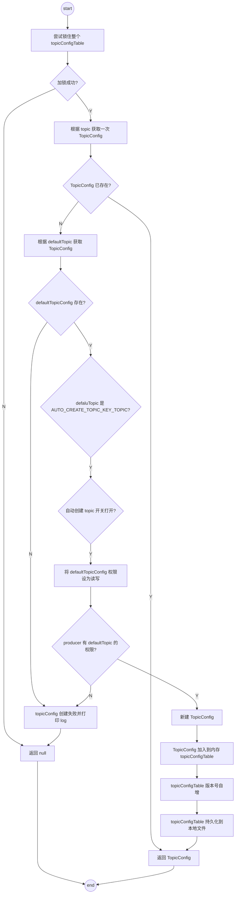
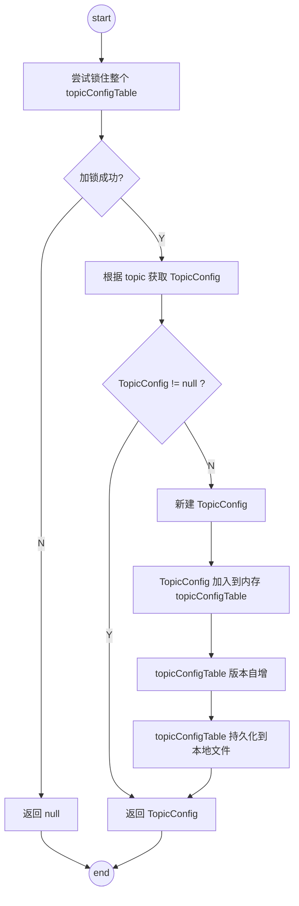
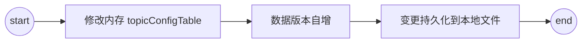

## 模块职责
1. 负责 topic 管理的类为 TopicConfigManager，提供了TopicConfig 的 CRUD 功能
2. TopicConfigManager 继承自 ConfigManager，具有 `load` 和 `persist` 功能

## 关键细节
1. 内置 topics
    1. SYS_SELF_TEST
    2. AUTO_CREATE_TOPIC_KEY 默认 topic 配置的 key，当自动创建 topic 开关打开后，会用这个 topic 的配置作为 topic 的默认配置
    3. SYS_BENCHMARK
    4. clusterName
    5. brokerName
    6. SYS_OFFSET_MOVED
    7. SYS_SCHEDULE：用于暂存待发送的延时消息
    8. Trace Topic
    9. Replace Topic: `ClusterName + REPLAY_TOPIC_POSTFIX`
2. 内存数据结构：`ConcurrentHashMap`，key 为 topicName，value 为 TopicConfig

### 处理流程梳理
1. `createTopicInSendMessageMethod`： 在 `AbstractSendMessageProcessor#msgCheck` 中调用，当根据当前 request 的 topic 属性选择 Config 失败时，会调用此方法

2. `createTopicInSendMessageBackMethod`：在`SendMessageProcessor#asyncCOnsumerSendMessageBack` 方法中调用

3. `createTopicOfTranCheckMaxTime`：实现逻辑和 `createTopicInSendMessageBackMethod` 一致，区别是 `createTopicOfTranCheckMaxTime` 中的 topic 是 `RMQ_SYS_TRANS_CHECK_MAX_TIME_TOPIC`，是一个内置的事务消息专用 topic

4. `updateTopicConfig`/`deleteTopicConfig` 修改或删除某个 TopicConfig，基本逻辑相同，分为如下 3 步

## 总结
1. RMQ 的 TopicConfigManager 由`内存 ConrrentHashMap + 版本号 + 持久化文件`组成
2. TopicConfig 每次变更（新增、更新、删除）都会让版本号自增，版本号由`时间戳 + AtomicLong` 组成
3. TopicConfigManager 支持从文件加载初始配置，逻辑和 `ConfigManager` 相同
