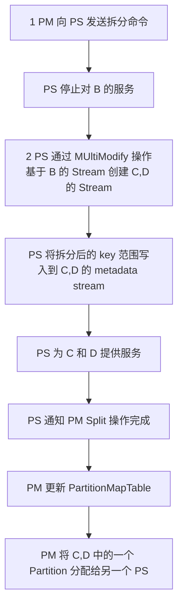
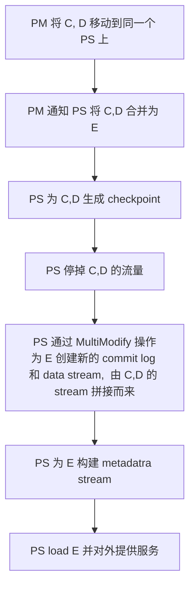

> 原文地址 https://sigops.org/s/conferences/sosp/2011/current/2011-Cascais/printable/11-calder.pdf

1. 数据模型：Blob（文件）、Table（结构化数据）、Queue（消息）
2. 主要特性
    1. 强一致性
    2. 全球维度、可扩展的命名空间：任何地区的用户都可以访问数据
    3. 灾难恢复：WAS 将数据存储在不同的数据中心中，数据中心之间相隔上百英里
    4. 多租户
3. 全球命名空间
    1. 形式：`AccountName` + `PartitionName` + `ObjectName`
        1. AccountName：用户选择的账号名，是 DNS host name 一部分，用于定位 primary storage cluster 和数据中心
        2. PartitionName：用于定位数据在哪个节点
        3. ObjectName：可选，用于定为数据对象
4. 架构
    1. Storage Stamps: 存储节点集群，包含多个 rack（故障域），包含 3 层
        1. Stream 层：负责将数据落盘，维护副本数量（replicating），Stream即文件，由一系列有序的 chunk 组成，每个 chunk 称为 extent
        2. Parition 层：数据访问层
            1. 提供上层的数据抽象，如 blob, table, queue
            2. 提供对象命名空间
            3. 在 stream 层上存储对象数据（object data）
            4. 缓存数据对象减少磁盘 IO
            5. 将一个集群内的对象数据进行分区，从而实现伸缩性
        3. Frond-End 层：由一系列无状态服务组成，包括查找 AccountName、认证授权、路由
    2. Location Service：管理所有 Storage Stamps 和所有集群的 Namespace 账号
        1. 增加 region， location, stamp
        2. 记录每个 storage stamp 的资源利用情况
        
5. Replication Engines
    1. Intra-Stamp Replication(Stream Layer)：集群内的同步复制以确保写入数据的持久性，维护足够数量的副本，**Stream 级别**
    2. Inter-Stamp Replication(Partition Layer)：集群间的异步复制，用来容灾（两个集群内都有数据）或迁移数据，**object 级别**

## Stream Layer
1. Stream Layer：为 Partition Layer 提供文件系统的命名空间和接口，但是**只提供追加写语义**
    
    2. Extent：Stream 层数据复制的基本单元，由多个连续 Block 组成
    3. Stream：
        1. 每个 Stream 在命名空间中拥有一个命名
        2. Stream 在 Partition 层看起来像一个大问题件
        3. Stream 是多个 Extent 指针的有序列表
        4. Stream 可以通过串联多个 Extent 来构造
        5. Stream 中只有最后一个 Extent 可写，其他 Extent 只读（Sealed）
2. 主要组件：StreamManager & Extent Nodes
  
3. StreamManager 职责
    1. 管理元数据，即 extent 与 stream 映射关系、extent 分布信息
    2. 监控所有 EN 节点健康状况
    3. 创建 extent 并分配给 EN
    4. 当 EN 硬件故障或不可用时，进行 extent 复制
    5. 对 extent 进行 GC，回收没有任何 stream 指向的 extent
    6. 根据 stream policy 调度 EC
4. StreamManager 特点
    1. 不知道 Block 的概念，只关注 stream 和 extent
    2. SM 不在客户端请求的关键路径上
    3. SM 只管一个集群内的元数据，因此内存中足够保留这些信息
5. Extent Node 职责：负责存储所分配的 extent
6. Extent Node 特点
    1. 不知道 Stream 的概念，只知道 extent 和 block
    2. 磁盘结构：每个 extent 是一个保存数据块列表、数据块checksum 及索引（`extent offset -> block + block file localtion`）
    3. 每个 EN 包含其所拥有所有 Extent 的视图，以及 extent peer 位置（SM 的缓存）
7. Append & Seal Extent
    1. Append 保证原子性
    2. Append 允许一次写多多个 block
    3. 如果 client 调用 append 失败，应当重试或 seal extent，对于事务写通过 sequence number 去重，对于数据，RangePartition 只会指向最后一次写入，之前的写入会被 GC
    4. Extent 具有 target size，由 Paritition Layer 指定，达到 target size 后，extent 变为 sealed（不可写）
8. Stream Layer 提供的保证
    1. EN 向 client 返回”数据写入成功“后，之后的读操作从任何一个副本都能读到相同的数据
    2. Extent 变为 Sealed 之后，任何一个副本数都能读到相同的数据
9. 复制流程（3 副本）
    1. 创建 extent 时，会为 extent 分配 3 个副本，1 主 2 从，**extent 副本主从关系和位置在 extent sealed 前不会发生变化**，因此不需要 lease
    2. client 写入到主 EN 上，由**主 EN 负责**将更新同步到从 EN，主 EN 职责如下
        1. 决定 extent 的写入 offset
        2. 存在多个并发写入时，为写入排序
        3. 将写入请求转发给 2 个从副本
        4. 只有当 2 个从副本都写入成功后，才给 client 返回写入成功
    3. sm 分配 extent 时，副本位置信息发送给 client，因此 client 知道副本位置和主 EN 是谁
    4. 当某个副本写入失败时，client 向 SM 报告错误，SM 将现在的 extent 副本变为 sealed，并在其他 EN 上重新分配 3 个副本，将新的位置信息返回给 client，同时 SM 会创建新的副本来保证可用副本数
10. Sealing
    1.  Sealing 操作由 SM 协调，`commit length` 由 SM 决定，一旦 sealing 操作完成，`comit length` 永远不会发生变化
    2.  定 `commit length` 逻辑
         1. SM 询问 3 个 EN，给定 extent 的当前长度
         2. 如果 3 个 EN 返回的长度都相同，则直接用这个长度
         3. 如果 2 个 EN 长度相同，另外一个 EN 长度更长或更短，在 SM **能访问**的 EN 中选择**最短的长度**作为 `commit length`，由于不是所有副本都写入成功，主 EN 还没给 client 返回写入成功，因此不会丢数据
         4. 如果 1 个 EN 在 Sealing 阶段无法被 SM 访问，但是 Sealing 结束后恢复，SM 会强制该 EN 将 extent 同步到 `commit length`
11. 发生网络分区，Partition Layer 只能和 EN 通信而无法和 SM 通信，解决办法如下
    1. 对于从已知位置读的场景，每次读都提供 offset 和 length，而 offset 和 length 是*之前成功的写操作返回的*，**可以保证所有的读看到的数据相同**
    2. 从某个位置读到 stream 末尾的场景，只有在 partition layer load 时才会发生
       1. partition layer 保证，在 load 期间乜有写操作发生
       2. load 开始时，partition server 向 EN 发送 `check for commit length` 请求，来检查所有副本是否可用以及各副本长度是否相同，如果不同则 seal extent，保证在 load 期间所有副本的读视图相同
12. 为了节省成本，将 Sealed Extent 从 3 副本转为纠错码（EC），将冗余比降低到 1.3x-1.5x
13. 读请求负载均衡
    1. 每个读请求会携带一个 dealine，如果 EN 判断无法满足 deadline 约束就不尝试处理，直接给 client 返回结果，让 client 尝试其他 EN
    2. 在 EC 场景下，如果某个数据分片所在 EN 负载很高，处理很慢，client 可以将读请求发送到其他数据分片和编码分片所在 EN，重建出所读的数据分片
14. 由于 HDD 为了获得尽可能高的吞吐，通常会优先处理顺序读写，从而导致其他 IO 请求饥饿，在 WAS 通过自定义 IO 调度来保证 IO 请求公平性
15. EN 上会保留一块盘作为日志盘，数据写入时先将数据追加到日志盘上，然后将写数据盘的请求入队，就可以返回写入成功
    1.  在数据搬到数据盘之前，数据缓存在内存中，读请求可以直接从内存读
    2.  减少了读写请求对数据盘的竞争，改善了写入延迟

## Partition Layer
1. 职责
   1. 为不同存储对象类型（Blob, Table, Queue）提供数据模型和语义
   2. 为存储对象提供命名空间支持
   3. 为访问存储对象提供负载均衡能力
   4. 为访问存储对象提供事务顺序和强一致性保证
2. ObjectTable：内部数据结构
   1. 动态划分成多个 RangePartition
   2. 每个 RangeParitition 是一系列连续有界的 key
   3. 不同 RangeParitition 之间的 key 没有冲地热
   4. 任何一个 key 都存在某个 RangePartition 中
   5. ObjectTable 可以增长到 PB 级别
3. Partition Layer 中 OT 的应用
   1. Account Table：存储每个账号的元数据和配置
   2. Blob Table: 存储集群中所有的 blob
   3. Entity Table：存储集群中所有的实体行，用在 Table 场景下
   4. Message Table：存储集群中所有的消息
   5. Schema Table：保存所有 OT 的 schema 信息
   6. Partition Table：保存所有 OT 的 RangePartition 及其位置信息，*用于路由*
4. Blob Table, Entity Table, Message Table 的主键由 AccountName, PartitionName, ObjectName 组成，会为这 3 个字段建索引
5. 架构
    1. Partition Manager(PM)
        1. 负责将 OT 分割成 RangePartition
        1. 将 Partition 分配给 Partition Server(PS)，保证一个 Partition 会且只会分配给一个 PS，不同 PS 的 RangePartition 间没有重叠
        1. 保存 Partition 和 PS 之间的映射关系，维护在 Partition Map Table 中
        1. 负责 PS 之间 RangePartition 的负载均衡
        1. 同时会运行多个 PM 实例，通过 LockService 选主，主节点保持 lease
    1. Partition Server(PS)
        1. 负责处理 RangePartition 上的请求
        1. RangePartition 持久化在 stream 上，PS 中维护内存缓存
        1. 通过 LockService 保证，同一个 RangePartition 不会同时被 2 个 PS 实例维护，从而提供强一致性
        1.  一个 PS 实例可以同时为多个 OT 的 RangePartition 提供服务
    1. Lock Service：提供类似 Chubby 的分布式锁服务


6. RangePartition
    1. 持久化数据结构：由 Metadata Stream, Commit Log Stream, Row Data Stream, Blob Data Stream 组成，采用 LSM Tree 结构维护
        1. Metadata Stream：维护 RangePartition 的入口，为 PS 提供足够的信息用来载入 RangePartition，将分片分配给 PS 时即为该 PS 提供 RangePartition 的 Metadata Stream 名称
        1. Commit Log Stream：保存最近的写操作（插入、更新、删除）的操作日志
        1. Row Data Stream：保存 RangePartition 的 checkpoint
        1. Blob Data Stream：仅被 Blob Table 用于存储 blob 数据
    1. 内存数据结构：由 Memory Table, Index Cache, Row Data Cache, Bloom Filters 组成
        1. Memory Table: commit log 的内存缓存，缓存还未写入到 checkpoint 的内存状态
        1. Index Cache: 保存 checkpoint 索引，checkpoint 的索引和数据分开缓存，以保证在内存中缓存尽可能多的索引
        1. Row Data Cache: 保存 checkpoint 数据，查询时同时查 Row Data Cache 和 Memory Table，类似 LSM Tree 中的 Immutable Memory Table
        1. Bloom Filters: 用于判断某个 key 是否在 RangePartition 中
7. RangePartition Load Balancing
    1. 由 Load Balance, Split, Merge 3 种操作完成
        1. Merge: 当某个 PS 上流量太高时，将上面的部分 RangePartition 分配到到 其他 PS 上
        1. Split: 将一个 RangePartition 分类成 2 个或多个 RangePartition，然后对分割后的 RangePartition 进行负载均衡
        1. Merge: 将冷数据和刚加载的(lightly loaded) RangePartition 合并到一起，要求合并前的 RangePartition key 范围连续
    1. 维护 RangePartition 总数的高、低水位，保证其数量在一定范围内
        1. 当 RangePartition 总数到达高水位，则加快 Merge 速率
        1. 当 RangePartition 总数到达低水位，则加快 Split 速率
    1. PM 从每个 PS 收集每个 RangePartition 的指标，根据指标来决策是否需要对 RangePartition 进行 Split/Merge/Load Balance，收集指标包括 tps, 平均等待 tps，限流比率, CPU 利用率，请求延迟，RangePartition 数据大小
    1. LoadBalance 动作由 PM 先给旧 PS 发送 `unload`，然后再给新分配的 PS 发送 `load` 实现
    1. Split 决策由 PM 做出，分割的 key 范围由 PS 决定
8. Split 操作步骤：将 RangePartition B 拆分为 (C, D)

9. Merge 操作步骤：将 RangePartition C, D 合并为 E

10. Partition Layer 集群间副本复制（跨地域复制）
    1. 用户的集群分为 1 主 2 备，只有主接实时流量
    1. 异步同步：主写入成功后，向 client 返回写入成功，然后向备同步更新

## Design Choices and Lessons Learned

1. 计算存储分离：计算和存储能够独立扩展和负载均衡、容易实现多租户
1. Range Parititon vs Hashing：选择基于范围分片的原因
    1. 范围分片实现性能隔离更容易
    1. 范围分片对象分布的局部性更好，遍历效率更高
    1. 范围分片的劣势：对连续写入不友好，所有的写入都落在最后一个 RangePartition
1. 限流和隔离：使用 Sample-Hold 算法从历史请求中找到 top N 个最忙的 account 和 partition，判断是否需要限流
1. 自动负载均衡
    1. 最初使用请求延时和请求率的乘积作为负载指标，在大部分场景下能够很好公祖，但是**无法发现因为扫描和网络利用率高而引起的 CPU 利用率高**的问题，因此加入了 CPU 利用率，网络负载指标
    1. 上述策略处理不好*分区分裂*(split)情况，因此引入了专门的机制，即**根据请求限流、超时、分区大小**来决定是否需要分裂分区
1. 不同 RangePartition 的 Log 文件独立维护：在多租户场景下提供隔离性
1. 日志（Journaling）：最初发布 WAS 时没有 Journaling，遇到了很多读写流量互相干扰的问题，同时也行优化小块 IO 写入，最终引入了 Journaling
1. Append-only System：
    1. 收益
        1. 简化了复制协议和故障处理
        1. 低成本地建和保存快照、提供多版本
        1. 在调查问题、恢复系统方面带来了很大收益
    1. 代价
        1. GC 必须高效、可扩展
        1. 虚拟地址空间保存的数据可能磁盘布局并不相同，在大数据集的情况下需要实现预取(prefetching) 逻辑
1. End-to-End Checksum：能够有效避免写入损坏数据、发现节点硬件故障
1. Upgrade:
    1. 升级域：类似故障域，多个节点组成一个升级域
    1. 存在 Y 个故障域的情况下，一次最多允许升级 1/Y 的服务器
    1. 采用滚动升级的方式来保证可用性
    1. 升级期间存储节点需要下线，停机前需要同时 PM 将 RangePartition 挪到其他 PS 上
    1. 升级期间会限制同一个升级域中最多允许失败的数目，超过限制则停止升级
    1. 升级后运行一系列测试进行验证，然后才会升级下一批机器
1. 同一个数据栈多种数据抽象：
    1. 允许 Blob, Table, Queue 这些数据抽象使用相同的数据复制策略、负载均衡系统、享受 stream 层和 partition 层的改进收益
    1. 可以使用相同的硬件，从而降低成本
1. 使用系统定义的 Object Table：使用系统定义的 Object Table 来实现 Blob, Table, Queue 抽象而不是暴露原始的 Object Table 语义给用户，从而降低了管理维护成本，同时能够独立于用户抽象而升级内部数据结构1. 限制单个用的存储空间不超过 100TB
