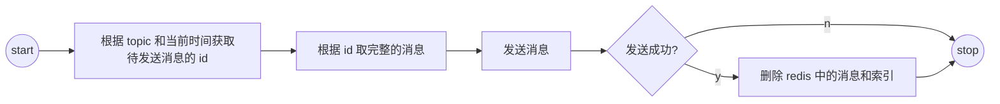
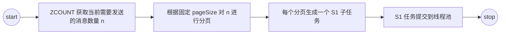
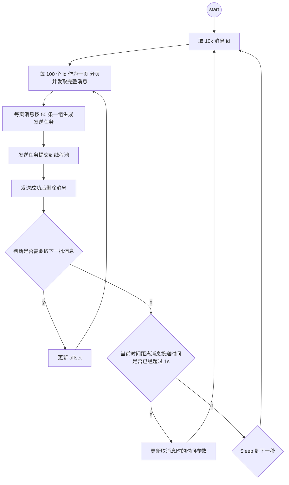

<!-- START doctoc generated TOC please keep comment here to allow auto update -->
<!-- DON'T EDIT THIS SECTION, INSTEAD RE-RUN doctoc TO UPDATE -->
**Table of Contents**  *generated with [DocToc](https://github.com/thlorenz/doctoc)*

- [背景](#%E8%83%8C%E6%99%AF)
  - [存储结构](#%E5%AD%98%E5%82%A8%E7%BB%93%E6%9E%84)
- [问题及优化思路](#%E9%97%AE%E9%A2%98%E5%8F%8A%E4%BC%98%E5%8C%96%E6%80%9D%E8%B7%AF)
  - [关闭 testOnBorrow](#%E5%85%B3%E9%97%AD-testonborrow)
  - [发送流程优化](#%E5%8F%91%E9%80%81%E6%B5%81%E7%A8%8B%E4%BC%98%E5%8C%96)
    - [增加 S1 子任务并发度](#%E5%A2%9E%E5%8A%A0-s1-%E5%AD%90%E4%BB%BB%E5%8A%A1%E5%B9%B6%E5%8F%91%E5%BA%A6)
  - [读写分离](#%E8%AF%BB%E5%86%99%E5%88%86%E7%A6%BB)
  - [其他问题](#%E5%85%B6%E4%BB%96%E9%97%AE%E9%A2%98)
- [总结和思考](#%E6%80%BB%E7%BB%93%E5%92%8C%E6%80%9D%E8%80%83)
- [写在最后](#%E5%86%99%E5%9C%A8%E6%9C%80%E5%90%8E)

本文记录了将公司自建延时消息服务， 单 topic 发送能力 TPS 从 300 优化到 15K TPS 过程中做过的尝试，以及相关的总结和思考。

## 背景
出于成本和掌控的诉求，公司在今年 Q3 开始计划自建延时消息服务，需要满足如下技术指标：
- 单 topic 发送能力 10k TPS
- 消息发送时间误差小于 1s

延时消息服务需要提供发送延时消息、更新延时消息、取消延时消息能力，结合公司现状最终确定的架构方案如下图所示，其中主流程可以分为存储链路和发送链路，链路职责如下：
- 存储链路：接受用户请求，将需要发送的延时消息暂存到 redis
- 发送链路：定时扫描 redis，将到时间的消息发送出去



### 存储结构
- 消息索引：我们采用一个 zset 作为消息索引，其中 score 为消息的投递时间戳，value 为消息的 id，消息 id 全局唯一
- 完整消息：通过 kv 存储，其中 key 为消息 id，value 为完整消息 JSON 序列化成字符串后，其中消息体需要先进行一次 base64 编码，把 byte[] 变成 String

## 问题及优化思路
从监控大盘上看，第一版代码测试时发现，存储 TPS 能到 6K，但是发送 TPS 只有 300 多，发送链路的内部逻辑如下图

### 关闭 testOnBorrow
看单次访问 redis 的时间在 5ms 左右，而每次从连接池里取连接的耗时也稳定在 3.5ms，到这里有两个可能第一网络很慢,第二redis 服务端处理很慢，从 redis 服务端的监控来看处理很快，基本在微秒级就可以返回，基本可以确认是网络相关的问题。

再在服务的测试实例上 ping redis server，从 ping 来看大概需要 3.5 ms，和从 jedis 连接池中取连接的耗时基本一致，考虑到连接池应该是在内存中缓存了建立好的连接，不应该每次都需要耗时这么久，怀疑是开了 `testOnBorrow` 相关的设置，关闭这个设置之后 `borrowJedis` 的耗时降低到 5us，如下图所示



### 发送流程优化
发送流程上有三个关键的步骤，即取消息 id（记为 S1）、取完整消息（记为 S2）、投递消息到真实的 topic（记为 S3），其中最后一步是直接发送到 RocketMQ broker 逻辑很简单没什么优化空间。所以重点在于如何充分利用机器的 CPU 来增加取消息 id 和取完整消息的并发度，从而提升整个发送流程的吞吐。

首先，对于串行的 S1、S2、S3 三个步骤，定义出 3 个子任务，每个子任务可以独立并发、不同的子任务之间可以用流水线加速。 例如用 1 个 S1 任务取 10K 消息 id，然后拆分为 100 个  S2 任务并发去消息，每个 S2 任务取完消息再生成一个 S3 任务进行消息投递。

#### 增加 S1 子任务并发度
对于 S1 子任务，可以通过先 count 待发送消息数量，然后在内存中分页，根据分页并发取的形式来提升并发度，执行流程如下图

从压测结果来看，如果某一秒需要发送大量消息时，发送 TPS 会上不去，从监控上看 `zrangebyscore` 的耗时 TP99 达到了 30s，redis server 的 CPU 利用率到了 100%。从 [redis 的官方文档](https://redis.io/commands/zrangebyscore)来看，当 `offset` 很大时，`zrangebyscore` 的性能很差，结合 redis 服务端提供的慢查询日志，符合这个说明。因此**这个优化并没能生效**。在延时消息的场景下，**每次取一批消息之后，需要确认消息已经成功发送到 RocketMQ Broker 之后才能删除 Redis 中缓存的消息和索引，否则可能会丢消息**。因此在整个发送流程中，无法直接每次通过 `ZREM` 取索引的前一批消息 id，避免用 `zrangebyscore`。
出于避免将 redis server CPU 打满的考虑，只能放弃增加 S1 子任务的并发度，改为增大 limit size，一次多取一些消息 id。 #### 增加 S2 S3 子任务并发度
S2 和 S3 子任务之间可以互相并发，可以分页打散，原因如下：
 - 对于 S2 子任务，输入数据为消息 id，不依赖其他状态
 - 对于 S3 子任务，输入数据为从 redis 中取出来的消息，不依赖其他状态
考虑读写 redis 和写 RocketMQ Broker 之间的耗时差异，**对 S2 和 S3 子任务采用不用的 pageSize**，保证不同任务之间耗时基本相同，从而提升线程池的利用率。

最终的发送流程如下图所示

### 读写分离
在压测过程中发现，单独测试发送和写入时，TPS 表现符合预期，同时测试写入和发送时，系统整体的 TPS 有所下降，各自的线程池都有堆积。因此，出于隔离的考虑，将发送链路和写入链路拆分到不同的进程，拆分之后写入进程无状态。

### 其他问题
 在优化过程中，除了上述的问题，还遇到两个小问题
1. 考虑使用  redis `hash` 来存储消息，而不是 string，来提升单个查询请求的性能降低存储空间，从 benchmark 来看从本地 redis 读 100W 消息的吞吐大约有 32% 的提升，考虑到改成 hash 之后会有热点问题，最终将这个尝试废弃
2.  由于上述的 3 个子任务没有原子性的保证，可能存在有些消息体已经删了，但是 id 还存在的情况，在取消息的时候做了兜底处理

## 总结和思考
结合本次性能优化，得到如下总结和思考
1. 无法观测就无法优化，因此充分的观测埋点对于性能优化至关重要
    1. 在压测和优化过程中，主要关注写入、发送的 TPS、线程池的活跃线程数、queue size，归根接地还是 RED 和 USE
    2. 观测工具、大盘需要逐步迭代，一开始只关注最核心的即可，遇到确实的再补
    3. 指标埋点，也能帮忙发现一些异常的逻辑错误，如果出现一些明显反直觉的指标，不妨看看是不是哪些有 bug
2. 理论上有提升的地方，很有可能并不如理论，还需要实验验证
3. 多读读官方文档，避免踩错误用法踩到坑里，例如 `zrangebyscore` 给一个很大的 offset

## 写在最后
本文只是作者对优化过程的简单记录和总结，有相关需求和问题的同学欢迎交流讨论。
